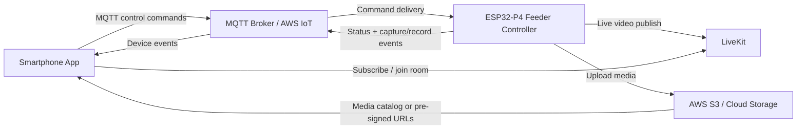

# Lab 8 Smart Bird Feeder Smartphone App Report

## A. Feature Implementation Explanation

### MQTT command buttons
The app includes dedicated buttons for `capture_photo`, `start_video_recording`, `stop_video_recording`, `start_live_stream`, and `stop_live_stream`. Each button publishes a JSON command message to the MQTT command topic configured for the Lab 7 backend. The payload includes the command name, a source tag (`smartphone-app`), a timestamp, and a request ID so the ESP32-P4 and cloud services can correlate requests and responses.

### Live stream viewer
The live stream panel connects to LiveKit using a configurable LiveKit URL and token. If the token is not stored directly in the app, the app can fetch one from a token service endpoint. When the feeder publishes a live stream into the LiveKit room, the app attaches the remote video track to the phone view so the user can monitor the feeder in real time.

### Photo capture preview
When the backend publishes a photo event, the app listens on the MQTT status/event topics and adds the returned media URL to the photo gallery. Tapping a photo opens an in-app preview card that shows the full-size image and its timestamp.

### Recorded video browser
The app loads cloud media through a configurable catalog endpoint. That endpoint is intended to return the photo and video metadata, including S3 or pre-signed URLs generated by the Lab 7 cloud layer. The video browser shows thumbnails for recorded clips and lets the user select one for playback.

### Video playback
Selected recorded videos render in the preview panel with native HTML video controls. This allows playback directly inside the smartphone UI without needing a separate media player.

### Cloud service connection
The app does not hardcode cloud credentials. Instead, it reads MQTT, LiveKit, and media catalog settings from environment variables. This keeps the phone app lightweight and lets the Lab 7 backend manage AWS IoT, S3, and LiveKit authentication.

### ESP32-P4 command communication
The phone app sends commands to the ESP32-P4 through the MQTT broker. The same MQTT connection also listens for status and event updates, which lets the app show when the device starts or stops streaming, captures a photo, or finishes recording a video. That feedback closes the loop between the phone and the feeder hardware.

## B. AI-Assisted Development Plan

### Step-by-step implementation plan
1. Identify the backend interfaces from Lab 7: MQTT topics, LiveKit room settings, and cloud media endpoints.
2. Define environment variables so the phone app can target the existing backend without hardcoded secrets.
3. Build the command panel for photo capture, recording, and live stream control.
4. Implement MQTT publish/subscribe behavior for command delivery and device feedback.
5. Add a LiveKit viewer that joins the feeder room and attaches the remote video track.
6. Add cloud media browsing for photos and recorded videos using URLs returned by the backend.
7. Add preview/playback panels and a real-time log so users can see cause-and-effect between app commands and backend responses.
8. Style the UI for mobile use and verify the layout stays readable on a phone screen.

### Data flow flowchart

## C. AI Q&A Summary

- How should the app send MQTT commands?
  - Use a browser-safe MQTT client over WebSocket and publish JSON command messages to a configurable command topic.
- How should the app connect to LiveKit?
  - Use the LiveKit room URL plus either a direct token or a token service endpoint, then attach the remote video track to the UI.
- How should the app retrieve S3 media?
  - Use a media catalog endpoint that returns photo/video metadata and URLs, ideally pre-signed URLs from the cloud backend.
- What app screens are needed?
  - A control panel, a live stream viewer, a cloud media browser, a preview/player panel, and a feedback log.
- How should the ESP32-P4 and app share command topics?
  - Keep a dedicated command topic and subscribe to status/event topics so the app can see confirmations and media updates.
- How can the app show that the system responded?
  - Surface MQTT status messages, add new media items when the device reports them, and log each command-to-response sequence.

## D. AI Usage Statement
AI helped with planning the app structure, mapping the Lab 7 backend connections into a phone-friendly UI, designing the MQTT command flow, and drafting the implementation/reporting steps. It also helped reason through the LiveKit viewer pattern, the cloud media catalog approach, and how to present device feedback in a way that shows the phone command caused the backend response.

## Submission Notes
- Git commit graph screenshot: capture this from your repository history before submission.
- Demo video: record the app sending commands, receiving MQTT feedback, showing LiveKit video, and opening photo/video previews.
- The code is configured for Lab 7 backend values through environment variables so you can connect it to the existing ESP32-P4/cloud services.
